# Percona Database Concurrency Issues Demonstration

## Introduction
This document provides a guide to setting up Percona with Docker Compose and demonstrates four key database concurrency problems: Lost Update, Dirty Read, Non-Repeatable Read, and Phantom Read. Each section includes SQL commands to replicate these issues and placeholders for screenshots.

## Setup

### Starting Percona and Adminer with Docker Compose
Run the following command to start the Percona and Adminer services:

```bash
docker compose up -d percona adminer
```

### Pre-Setup Commands
Before starting the demonstrations, execute these commands to configure the environment:

```sql
SET autocommit=0;
SET GLOBAL innodb_status_output=ON;
SET GLOBAL innodb_status_output_locks=ON;
```

To check the InnoDB engine status:
```sql
SHOW ENGINE INNODB STATUS;
```

## Concurrency Problems

### 1. Lost Update
This issue occurs when two transactions update the same record, and the last update overwrites the first, leading to a loss of data.

**Session 1:**
```sql
START TRANSACTION;
SELECT balance FROM users WHERE id = 1;
UPDATE users SET balance = balance + 100 WHERE id = 1;
-- Delay until commit in s2
COMMIT;
SELECT balance FROM users WHERE id = 1;
```

**Session 2:**
```sql
START TRANSACTION;
SELECT balance FROM users WHERE id = 1;
UPDATE users SET balance = balance - 50 WHERE id = 1;
COMMIT;
```

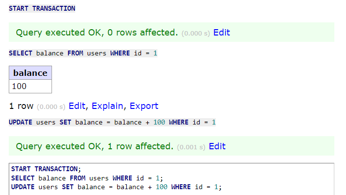
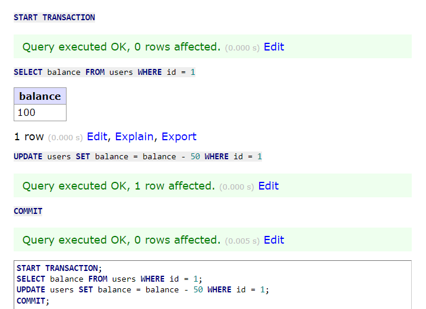
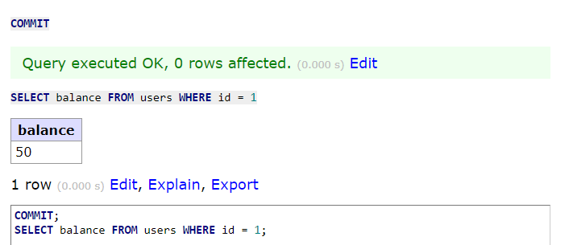

### 2. Dirty Read
Occurs when a transaction reads data that has been modified by another transaction but not yet committed.

**Preparation:**
```sql
SET SESSION TRANSACTION ISOLATION LEVEL READ UNCOMMITTED;
```

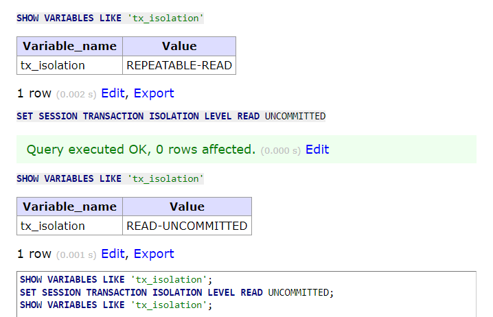

**Session 1:**
```sql
START TRANSACTION;
SELECT balance FROM users WHERE id = 1;
UPDATE users SET balance = balance + 100 WHERE id = 1;
```

**Session 2:**
```sql
SELECT balance FROM users WHERE id = 1;
```

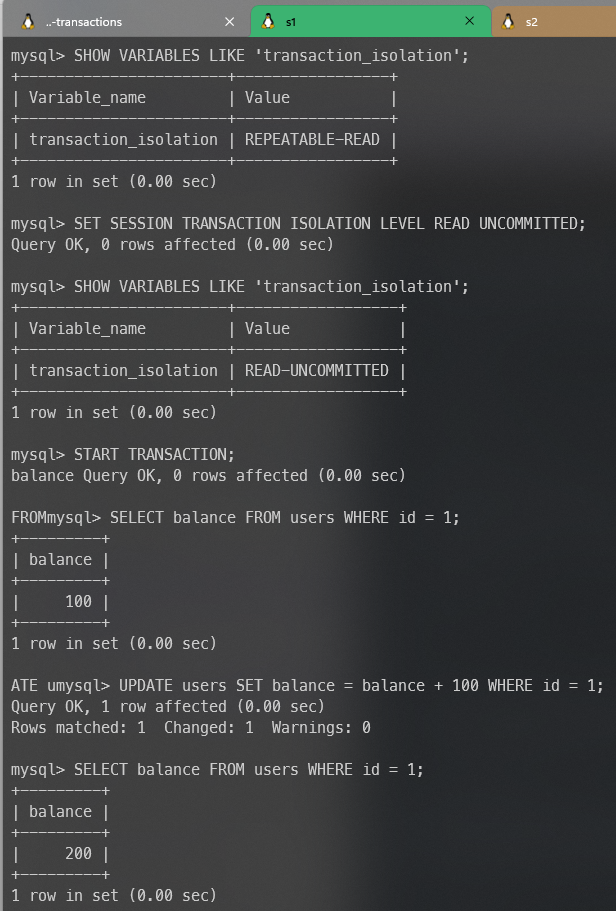
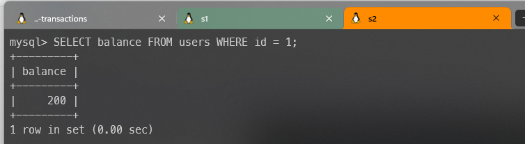

### 3. Non-Repeatable Read
This problem arises when a transaction reads the same row twice and gets different data each time due to another transaction's update.

**Preparation:**
```sql
SET SESSION TRANSACTION ISOLATION LEVEL READ COMMITTED;
```

**Session 1:**
```sql
START TRANSACTION;
SELECT balance FROM users WHERE id = 1;
-- Delay until first select in s2
UPDATE users SET balance = balance + 100 WHERE id = 1;
COMMIT;
```

**Session 2:**
```sql
START TRANSACTION;
SELECT balance FROM users WHERE id = 1;
-- Delay until commit in s1
SELECT balance FROM users WHERE id = 1;
```

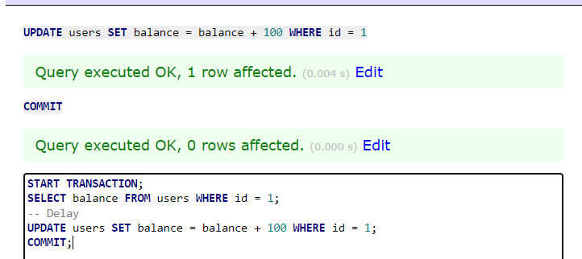
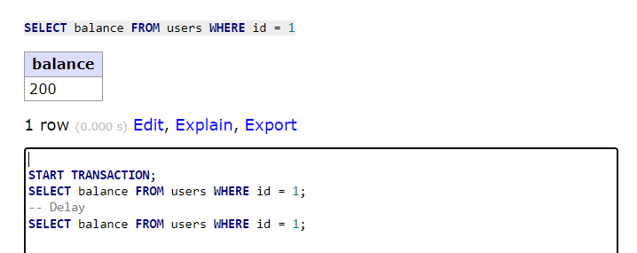


### 4. Phantom Read
A phantom read occurs when a transaction re-executes a query returning a set of rows that satisfy a search condition and finds that the set has changed due to another recently committed transaction.

**Preparation:**
```sql
SET SESSION TRANSACTION ISOLATION LEVEL READ COMMITTED;
```

**Session 1:**
```sql
START TRANSACTION;
SELECT balance FROM users WHERE balance > 600;
-- Delay until insert in s2
SELECT balance FROM users WHERE balance > 600;
```

**Session 2:**
```sql
START TRANSACTION;
INSERT INTO users (name, phone, email, date_of_birth, balance) VALUES ('Codey Johnson', '012-345-6789', 'codey.johnson@email.com', '1967-11-27', 700);
COMMIT;
```

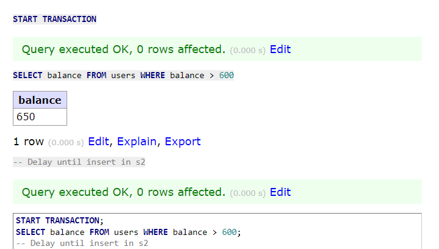
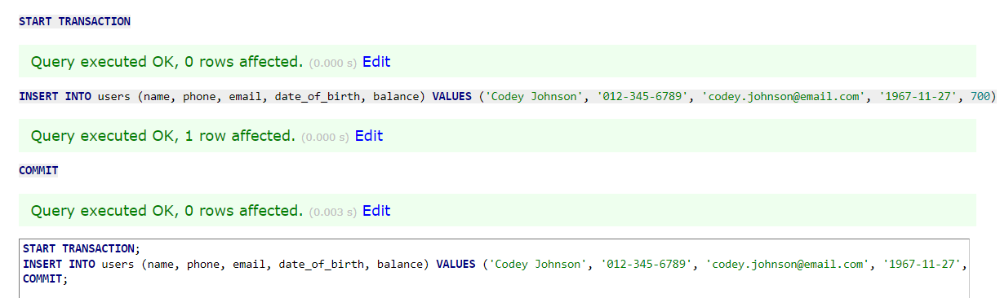
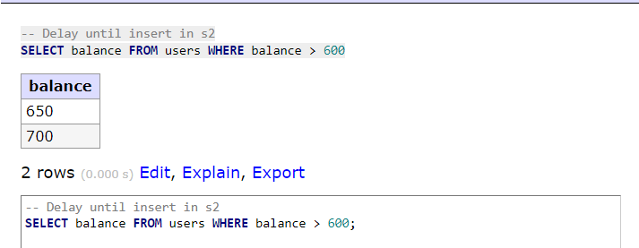
